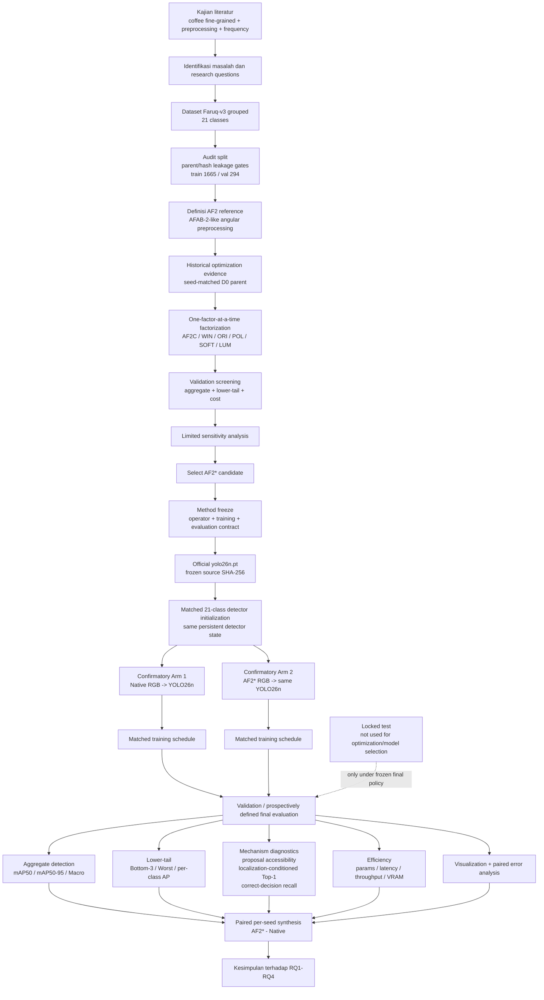
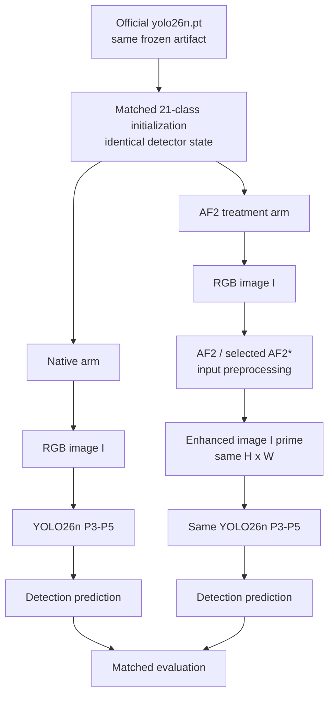
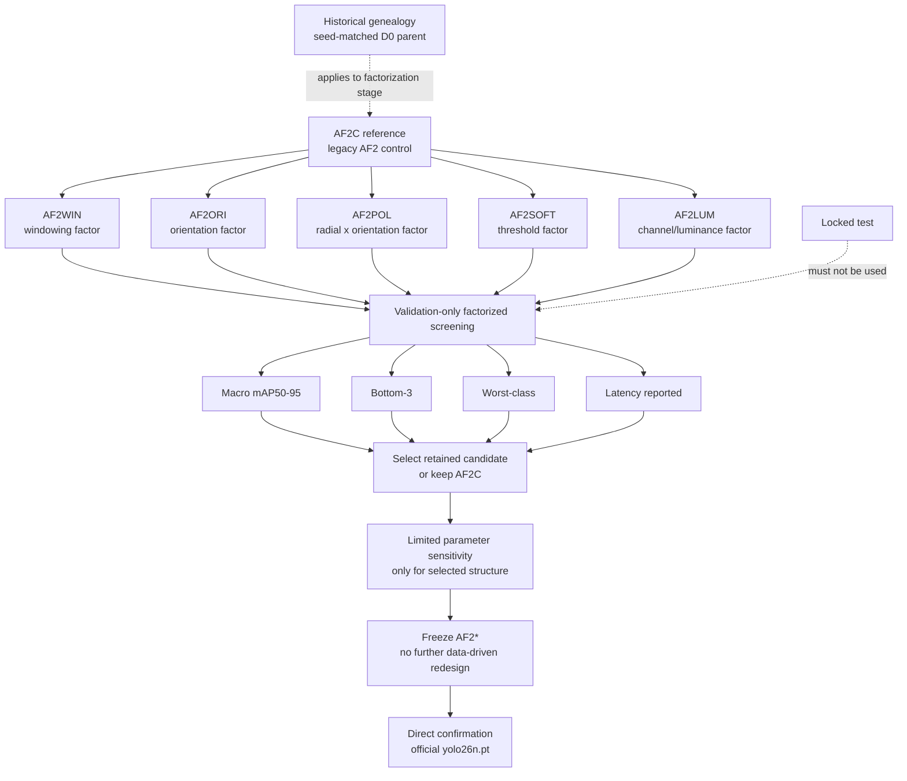

# Alur Penelitian / Research-Flow Specification

Status: **synchronized with Bab I–III, AF2 optimization genealogy, and primary-source hardening as of 2026-08-25**.

Purpose: provide the single source for Figures 3.1–3.4 that will later be redrawn in the formal campus proposal document.

The figures must preserve one methodological distinction throughout:

\[
\boxed{
\text{historical AF2 factorization / optimization}
\neq
\text{final direct confirmatory experiment}
}
\]

Historical factorization was conducted from seed-matched coffee-domain D0 parents. The final confirmatory design starts directly from the same official `yolo26n.pt` artifact for native and AF2 treatment arms. These evidence families must never be merged into one apparent training trajectory.

---

## Figure 3.1 — Kerangka Penelitian



### Narrative version

Alur penelitian dimulai dengan menghubungkan bukti pada domain kopi, teori fine-grained detection, literatur preprocessing, dan pemrosesan frekuensi. Dataset Faruq-v3 kemudian digunakan dalam grouped development split yang telah diaudit terhadap parent overlap dan exact-hash leakage.

AF2 reference didefinisikan sebagai frontend input-space yang mengadaptasi mekanisme angular amplitude suppression AFAB-2. Kata **Optimasi** dioperasionalkan melalui historical one-factor-at-a-time factorization: setiap kandidat mengubah satu keputusan desain terhadap AF2 reference. Historical factorization dipakai sebagai evidence untuk pemilihan struktur dan sensitivity, bukan sebagai pengganti eksperimen konfirmatori final.

Setelah kandidat AF2* dipilih, operator, protokol training, evaluation, dan fairness dibekukan. Native dan AF2* confirmatory arms kemudian dibangun dari official `yolo26n.pt` yang sama dengan target-head initialization yang dipadankan. Perbedaan treatment yang dimaksud hanya preprocessing AF2* pada input.

Evaluasi dipisahkan menjadi aggregate detection, lower-tail/per-class behavior, mechanism diagnostics, visualization/error analysis, dan efficiency. Hasil akhir disintesis sebagai paired per-seed delta. Locked test tidak digunakan untuk mengoptimasi AF2 atau memilih kandidat.

### Figure 3.1 guardrails

1. Historical optimization must be visually separated from direct confirmation.
2. Do not draw `D0 -> AF2* -> final model` as the final thesis training path.
3. Locked test must not feed candidate screening.
4. Optimization, confirmation, mechanism diagnosis, and efficiency must appear as distinct logical stages.
5. The final figure may simplify wording but must retain the source genealogy.

---

## Figure 3.2 — Arsitektur Perbandingan Native YOLO26 dan AF2–YOLO26



Conceptual model equations:

\[
\hat{Y}_{N}
=
\operatorname{YOLO26n}(I),
\]

\[
I'=\mathcal{A}_{FA}(I),
\]

\[
\hat{Y}_{AF2}
=
\operatorname{YOLO26n}(I').
\]

### Figure 3.2 guardrails

1. AF2 must be visibly **before** YOLO26, not inside backbone, neck, or head.
2. Native and treatment arms must visibly share the same detector source and matched target-head initialization.
3. Do not draw an additional trainable AF2 parameter branch; the current frontend has zero learned parameters.
4. Equal parameter count does not imply equal runtime; efficiency is evaluated separately.
5. Do not depict AFAB-1 radial high-pass in the pure AF2 reference path.

---

## Figure 3.3 — Detail Operator Preprocessing Frekuensi-Angular AF2

```mermaid
flowchart LR
    I[Input RGB I] --> U[Unfold local patches\n32x32, overlap 0.50]
    U --> F[FFT2 + fftshift\nrepository: FP32 FFT]

    F --> A[Amplitude A]
    F --> P[Original phase phi]

    A --> D[Angular density D(theta)\nparent: theta in 0..360]
    D --> PR[Normalize to p(theta)]
    PR --> H[Angular entropy H]
    H --> TH[Adaptive threshold tau\ngamma 0.10]
    D --> Q[Max-normalized density q]
    TH --> W[Directional hard weighting]
    Q --> W

    W --> C[Weighted complex spectrum]
    P -. phase retained conceptually .-> C

    C --> IF[IFFT2]
    IF --> FO[Fold + overlap averaging]
    FO --> MM[Per-image/channel min-max]
    MM --> G[Residual image gate]
    I --> G
    G --> O[Output I prime\nsame BCHW shape]
```

Conceptual/frozen implementation equations:

\[
D_i^c(k)
=
\sum_{(u,v):b(u,v)=k}A_i^c(u,v),
\]

\[
p_i^c(k)
=
\frac{D_i^c(k)}{\sum_jD_i^c(j)+\varepsilon},
\]

\[
H_i^c
=-\sum_kp_i^c(k)\log(p_i^c(k)+\varepsilon),
\]

\[
\tau_i^c
=
\frac{\gamma}{1+\exp(-H_i^c)},
\]

\[
q_i^c(k)
=
\frac{D_i^c(k)}{\max_jD_i^c(j)+\varepsilon},
\]

\[
w_i^c(k)=
\begin{cases}
0,&q_i^c(k)\le\tau_i^c,\\
q_i^c(k),&q_i^c(k)>\tau_i^c,
\end{cases}
\]

\[
\widetilde F_i^c(u,v)
=
F_i^c(u,v)w_i^c(b(u,v)),
\]

\[
I'
=
I+I\odot\operatorname{MinMax}(R_{AF2}(I)).
\]

### Source-origin annotation for the final figure

The formal figure should distinguish visually, by caption/legend rather than by adding clutter, between:

**Parent-method evidence from Xu et al. [FG-01]:**

- patch-wise local DFT;
- `m=32`;
- large-overlap rationale;
- angular density over `[0,360°)`;
- entropy-adaptive threshold concept;
- suppression of low angular-density directions;
- amplitude adjustment with original phase retained;
- patch-wise iDFT/recovered-space gating.

**Repository transfer/engineering decisions:**

- exact overlap `0.50`;
- independent RGB channels;
- 360 discrete floor bins;
- `replicate` padding;
- `norm="ortho"` FFT;
- FP32 FFT under CUDA/AMP;
- chunk size `128`;
- `fold` + overlap averaging;
- per-image/channel min-max;
- exact residual `I + I*MinMax(R)`.

### Figure 3.3 guardrails

1. Do not show `radius_ratio`; it is inactive in `mode=af2`.
2. Do not label AF2 as generic high-pass filtering.
3. Do not imply 360 discrete bins are directly specified by the parent paper; the parent specifies a continuous angular domain.
4. Preserve the distinction between amplitude weighting and original phase.
5. The exact Eq. (10)–(13) page locator in the Xu PDF remains a page-recertification task; do not add a fabricated page in the caption.

---

## Figure 3.4 — Optimasi Terfaktor, Pemilihan AF2*, dan Method Freeze



### Factorization definition

Each structural candidate changes one factor relative to the reference:

| Arm | Single factor changed | Scientific question |
|---|---|---|
| `AF2C` | none | reference control |
| `AF2WIN` | rectangular analysis/synthesis -> sqrt-Hann normalized OLA | does windowing reduce harmful spectral leakage? |
| `AF2ORI` | 360-direction representation -> 16 orientations modulo \(\pi\) | is orientation redundancy useful or unnecessary? |
| `AF2POL` | angular-only -> 3 radial bands × 16 orientations | does explicit radial structure add useful discrimination? |
| `AF2SOFT` | hard threshold -> soft transition | does discontinuous suppression harm useful weak directions? |
| `AF2LUM` | independent RGB gates -> shared Rec.709 luminance gate | are chromatic channel-specific spectral cues necessary? |

`PCG1` and `WAV1` may appear in an appendix or secondary mechanism comparison as **mechanistic alternatives**, not as extra AF2 factor toggles.

### Historical selection rule

The frozen historical factorization protocol retains a candidate versus `AF2C` only when:

- Macro mAP50–95 gain >= 0.5 point;
- Bottom-3 is not lower;
- Worst-class drop <= 1 point;
- all 21 validation classes remain present;
- test is not accessed.

The global winner is chosen primarily by Macro; ties within 0.2 Macro point use Bottom-3, then Worst-class, then lower measured latency.

These rules document historical optimization genealogy. They must not be rewritten retrospectively based on the pilot direct-AF2 result.

### Figure 3.4 guardrails

1. The diagram must look like **parallel factorization**, not cumulative module stacking.
2. Historical D0 parent must not flow into final direct confirmation checkpoint.
3. The direct confirmation box must restart from official `yolo26n.pt` under the frozen direct protocol.
4. Candidate screening uses validation only.
5. `PCG1/WAV1` must be visually separated if included.
6. Method freeze must occur before final/direct confirmatory interpretation.

---

## Planned repeated-seed flow

```text
seed 42   -> completed preliminary direct promotion screen
seed 123  -> confirmatory pair when the thesis experiment phase resumes
seed 2026 -> confirmatory pair when the thesis experiment phase resumes

final direct-AF2 claim
    requires repeated-seed synthesis
    + efficiency evidence
    + prospectively frozen final-test policy if/when test is opened
```

Proposal-writing status does not require launching the remaining runs now. In the proposal, seed-42 evidence must remain labeled **pilot/preliminary** and must not be drawn as a completed final result.

---

## Formal redraw checklist

Before export to the campus DOCX/PDF template:

1. redraw all four figures with consistent typography and figure numbering;
2. keep historical optimization and final confirmation visually distinct;
3. add source attribution in captions where appropriate: `[FG-01]` for parent AFAB/AFAB-2 concepts and `[DET-01]` for YOLO26 architecture;
4. do not paste screenshots of the paper figures as if they were original thesis graphics;
5. use original/redrawn diagrams derived from the verified specifications here;
6. run `BAB3_PRIMARY_SOURCE_HARDENING_2026-08-25.md` before locking captions.