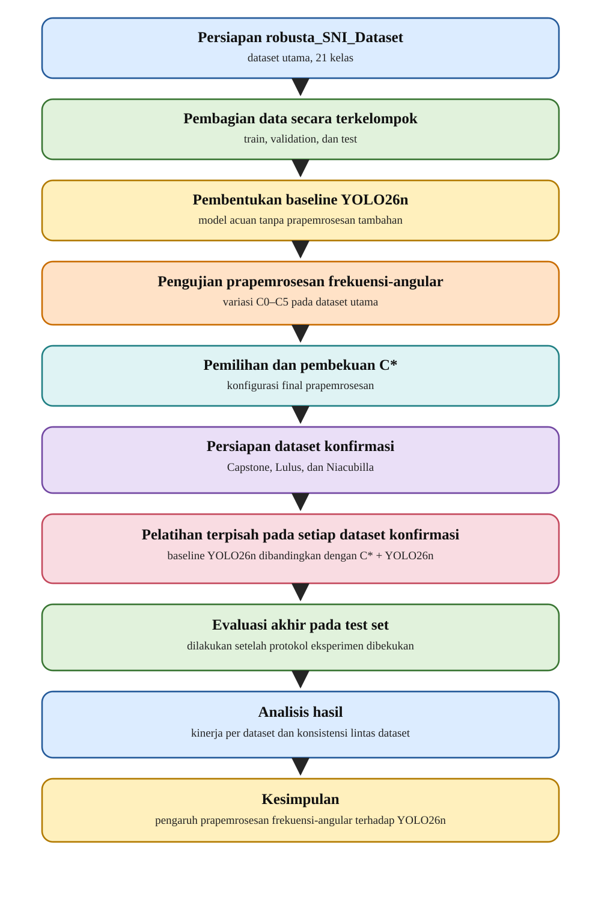
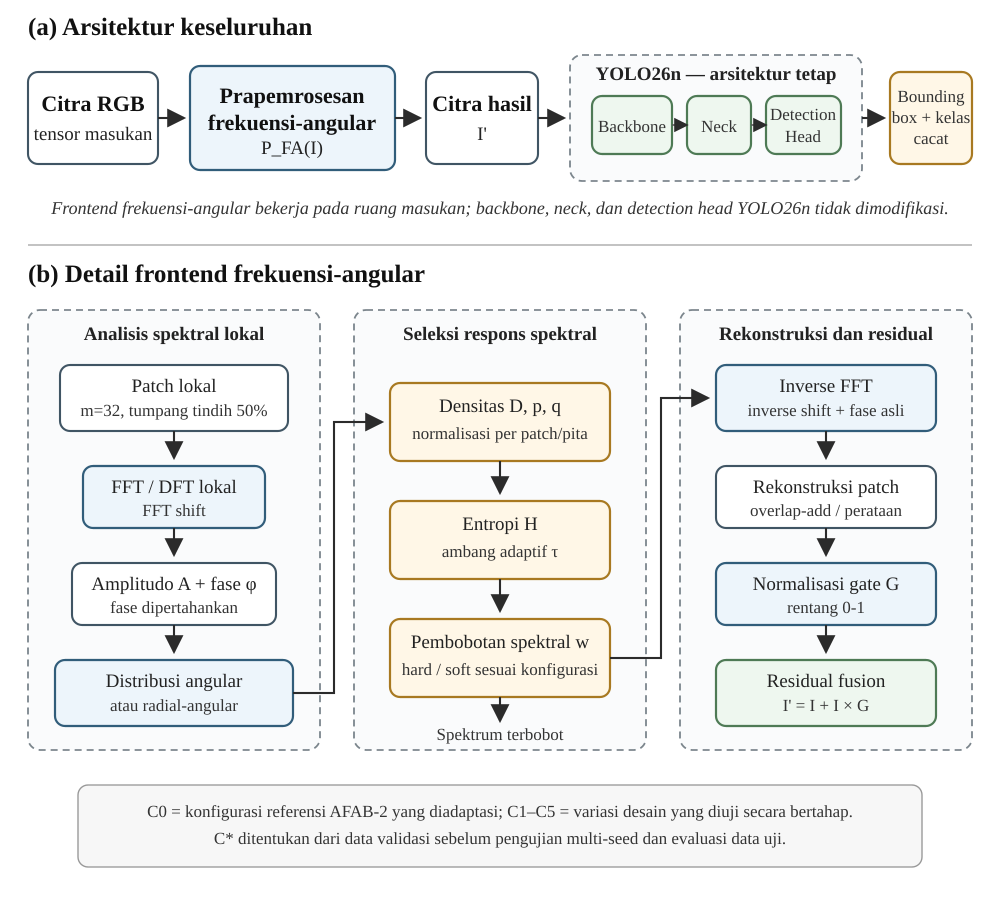

# BAB III
# METODOLOGI PENELITIAN

## 3.1 Rancangan Umum Penelitian

Penelitian ini menggunakan pendekatan eksperimen komparatif untuk menganalisis pengaruh prapemrosesan citra berbasis frekuensi-angular terhadap kinerja YOLO26n dalam mendeteksi cacat biji kopi yang memiliki perbedaan visual halus (*fine-grained*). Arsitektur YOLO26n dipertahankan tanpa perubahan pada perbandingan utama sehingga perbedaan antar kondisi eksperimen terutama berasal dari perlakuan terhadap citra masukan.

Secara umum, penelitian meliputi pengumpulan dan anotasi dataset primer, audit kecukupan data per kelas, pembagian data berbasis kelompok sumber, pembentukan model acuan pengembangan, penerapan konfigurasi referensi prapemrosesan frekuensi-angular, pengujian variasi desain dan analisis sensitivitas terbatas, pemilihan konfigurasi $C^*$, pelatihan ulang dengan beberapa *seed* konfirmasi untuk YOLO26n tanpa prapemrosesan, CLAHE, konfigurasi referensi, dan konfigurasi terpilih, evaluasi akhir pada data uji, serta analisis per kelas, kesalahan, visual, dan efisiensi komputasi. Evaluasi pada arsitektur deteksi lain ditempatkan sebagai analisis tambahan apabila sumber daya memungkinkan.

Alur penelitian dirangkum pada Gambar 3.1.

{width=12.5cm}

Gambar 3.1 Alur Penelitian

Perbandingan utama dapat dinyatakan secara konseptual sebagai:

$$
\hat{Y}_{N}=\mathrm{YOLO26n}(I),
$$

untuk YOLO26n tanpa prapemrosesan tambahan, dan:

$$
I'=\mathcal{P}_{FA}(I),
$$

$$
\hat{Y}_{P}=\mathrm{YOLO26n}(I'),
$$

dengan $I$ merupakan citra masukan, $\mathcal{P}_{FA}$ merupakan fungsi prapemrosesan frekuensi-angular, $I'$ merupakan citra hasil prapemrosesan, dan $\hat{Y}$ merupakan hasil prediksi deteksi. Persamaan tersebut hanya menunjukkan perbedaan pada jalur masukan dan tidak mengasumsikan bahwa prapemrosesan selalu meningkatkan kinerja.

## 3.2 Dataset Penelitian

### 3.2.1 Sumber dan Karakteristik Dataset Primer

Penelitian direncanakan menggunakan **dataset primer** yang dikumpulkan secara langsung untuk tugas deteksi objek multikelas pada biji kopi hijau. Daftar kelas awal menargetkan 20 kategori cacat fisik dan benda asing yang digunakan dalam penilaian SNI 2907:2008 ditambah satu kelas biji normal, sehingga jumlah kelas target awal dinyatakan sebagai:

$$
C_{target}=21.
$$

Jumlah tersebut merupakan target awal dan belum dianggap sebagai jumlah kelas final. Jumlah kelas akhir ditetapkan setelah audit kecukupan data per kelas dan sebelum pembagian dataset serta pelatihan utama dilakukan.

Setiap citra direncanakan memuat banyak objek. Oleh karena itu, ukuran dataset dinilai berdasarkan jumlah objek yang dianotasi, jumlah citra sumber yang berbeda, distribusi objek per kelas, dan penyebarannya pada kelompok sumber independen. Asal fisik sampel kopi, lot/batch, pemasok, kebun, koperasi, atau sumber pengadaan dicatat setelah sumber aktual ditetapkan dan dapat didokumentasikan; informasi tersebut tidak diasumsikan pada tahap proposal.

### 3.2.2 Target Pengumpulan dan Pemeriksaan Kecukupan Data

Target pengumpulan ditetapkan sekitar 180–220 citra sumber, dengan sasaran nominal sekitar 200 citra asli. Citra hasil augmentasi tidak dihitung sebagai data primer. Setiap citra direncanakan memuat sekitar 30–50 objek yang disusun dalam satu lapisan, dengan orientasi bervariasi dan tanpa tumpang tindih berat. Pada sasaran nominal 200 citra, jumlah anotasi objek diperkirakan berada pada kisaran:

$$
N_{box}\approx 6.000-10.000.
$$

Jika seluruh rentang rencana 180–220 citra dan 30–50 objek per citra digunakan, kisaran teoritisnya adalah sekitar 5.400–11.000 objek. Dengan demikian, 6.000–10.000 diperlakukan sebagai target nominal untuk sekitar 200 citra, bukan batas matematis seluruh skenario pengumpulan.

Sebagai target operasional awal, setiap kelas yang dipertahankan diupayakan memiliki sekurang-kurangnya sekitar 200 objek asli, dengan sasaran ideal sekitar 300–500 objek, serta muncul pada sedikitnya sekitar 30 citra sumber berbeda. Angka tersebut merupakan target perencanaan penelitian, bukan batas universal kecukupan dataset deteksi objek. Sebagai pembanding, Bahy dan Rifai (2026) melaporkan 107 citra dengan 13.863 anotasi untuk deteksi 20 kelas SNI, sedangkan Tarekegn dan Debelee (2025) menggunakan 562 citra dengan 19.228 objek untuk 13 kelas cacat dan satu kelas normal.

Sebelum pembagian data, distribusi setiap kelas diaudit berdasarkan:

$$
N_{obj,c},\qquad N_{img,c},\qquad N_{group,c},
$$

dengan $N_{obj,c}$ merupakan jumlah objek asli kelas $c$, $N_{img,c}$ jumlah citra sumber berbeda yang memuat kelas $c$, dan $N_{group,c}$ jumlah kelompok sumber independen yang mengandung kelas $c$. Dimensi kelompok diperlukan karena pembagian dataset dilakukan berbasis kelompok sumber.

Jika suatu kelas belum memenuhi target operasional, prioritas pertama adalah menambah pengumpulan data kelas tersebut. Apabila kecukupan data tetap tidak dapat dipenuhi, kelas tersebut tidak dipaksakan menjadi kelas evaluasi utama. Penggabungan kelas tidak dilakukan hanya karena kekurangan data kecuali terdapat dasar taksonomi atau SNI yang membenarkannya. Keputusan jumlah kelas final dilakukan sebelum pembagian dataset dan sebelum pelatihan utama sehingga tidak dipengaruhi oleh hasil performa model.

Jumlah kelas akhir dinyatakan sebagai:

$$
C\le C_{target},
$$

dengan target utama tetap $C=21$ apabila seluruh kelas memiliki data yang dinilai memadai.

### 3.2.3 Akuisisi Citra dan Anotasi

Pengambilan citra direncanakan dilakukan secara tegak lurus dari atas menggunakan latar belakang polos dan tidak reflektif, dengan posisi kamera, jarak pengambilan, dan pencahayaan yang dikendalikan. Biji kopi disusun dalam satu lapisan agar karakteristik permukaan tetap terlihat, sedangkan orientasi objek divariasikan untuk memperoleh variasi sisi dan arah biji.

Setiap sesi pengambilan dan citra sumber diberikan identitas yang dapat ditelusuri. Citra yang berasal dari sesi, susunan objek, atau kelompok spesimen fisik yang berkaitan diberi `group_id` yang sama. Definisi operasional `group_id` ditetapkan sebelum pengumpulan utama; satu *group* merepresentasikan unit sumber yang tidak boleh dipecah antar *split*, misalnya satu sesi pengambilan atau satu kelompok spesimen fisik yang saling berkaitan.

Untuk kategori yang definisinya bergantung pada ukuran fisik, khususnya benda asing yang dibedakan berdasarkan ukuran, proses akuisisi dilengkapi referensi skala agar ukuran fisik objek dapat ditelusuri secara konsisten.

Setiap objek diberi kotak pembatas (*bounding box*) dan label kelas. Definisi operasional setiap kelas ditetapkan sebelum anotasi dengan mengacu pada SNI dan referensi visual yang digunakan. Sampel yang secara visual meragukan ditandai untuk ditinjau kembali sebelum memperoleh label final. Validasi label direncanakan melibatkan praktisi atau validator yang memahami penilaian fisik mutu kopi, terutama pada kelas dengan kemiripan visual tinggi.

### 3.2.4 Pembagian Data dan Pencegahan Kebocoran

Pembagian dataset dilakukan terhadap citra sumber asli **sebelum augmentasi**. Proporsi awal yang ditargetkan adalah sekitar 70% untuk pelatihan, 15% untuk validasi, dan 15% untuk pengujian. Proporsi tersebut merupakan sasaran keseluruhan dan dapat bergeser sedikit untuk memenuhi keterwakilan kelas tanpa melanggar pemisahan kelompok sumber.

Pembagian dilakukan berdasarkan `group_id`, bukan sekadar pengacakan citra individual. Seluruh citra yang berasal dari sesi, susunan objek, atau spesimen fisik yang saling berkaitan ditempatkan pada bagian data yang sama. Jika suatu spesimen fisik difoto lebih dari satu kali, seluruh citra yang memuat spesimen tersebut harus berada pada *split* yang sama.

Kelompok sumber pada ketiga bagian dataset harus saling terpisah:

$$
\mathcal{G}_{train}\cap\mathcal{G}_{val}
=\mathcal{G}_{train}\cap\mathcal{G}_{test}
=\mathcal{G}_{val}\cap\mathcal{G}_{test}
=\varnothing.
$$

Selain menjaga pemisahan kelompok, pembagian mempertimbangkan distribusi kelas. Pada data validasi, setiap kelas ditargetkan muncul pada sedikitnya sekitar lima citra sumber. Pada data uji, target operasionalnya adalah sedikitnya 10 objek per kelas yang tersebar pada sedikitnya lima citra sumber, konsisten dengan Subbab 3.6.5. Target tersebut diterapkan sepanjang dapat dipenuhi tanpa melanggar pemisahan `group_id`. Pemeriksaan citra identik menggunakan nilai *hash* dilakukan sebagai lapisan tambahan untuk mendeteksi duplikasi file; mekanisme utama pencegahan kebocoran tetap identitas sumber dan `group_id`.

Data validasi digunakan untuk penghentian dini, pembandingan konfigurasi prapemrosesan, analisis sensitivitas, dan pemilihan $C^*$. Data uji disisihkan sejak awal dan tidak digunakan untuk memilih ukuran patch, parameter $\gamma$, variasi prapemrosesan, maupun keputusan metodologis lainnya. Evaluasi data uji dilakukan setelah konfigurasi akhir dan prosedur evaluasi dibekukan.

### 3.2.5 Augmentasi Data

Augmentasi hanya diterapkan pada bagian pelatihan setelah pembagian citra sumber selesai. Data validasi dan pengujian menggunakan citra asli tanpa augmentasi sintetis. Konfigurasi augmentasi dibuat sama untuk seluruh kondisi YOLO26n yang dibandingkan sehingga perbedaan hasil antar kondisi tidak berasal dari perbedaan strategi augmentasi.

CLAHE dan prapemrosesan frekuensi-angular diperlakukan sebagai perlakuan eksperimen terhadap citra masukan, bukan sebagai augmentasi dataset. Posisi kedua *frontend* tersebut terhadap augmentasi dan antarmuka masukan model dibuat setara sebagaimana dijelaskan pada Subbab 3.4 dan 3.6.

## 3.3 Model Dasar YOLO26n

YOLO26n digunakan sebagai model dasar pada eksperimen utama. Model menggunakan bobot pralatih resmi `yolo26n.pt` sebagai sumber inisialisasi. Setelah jumlah kelas akhir ditetapkan, bagian keluaran model disesuaikan dengan jumlah kelas $C$.

Pada setiap perbandingan, sumber bobot pralatih dan prosedur inisialisasi bagian keluaran dibuat setara. Bagian utama arsitektur YOLO26n, yaitu *backbone*, *neck*, dan *detection head*, tidak dimodifikasi pada eksperimen utama. Prapemrosesan yang dianalisis juga tidak menambahkan parameter yang dilatih. Dengan demikian, penelitian difokuskan pada perubahan representasi citra masukan.

### 3.3.1 Kondisi Eksperimen Utama dan Pembanding

Empat kondisi utama direncanakan sebagai berikut:

| Kode | Kondisi | Peran dalam eksperimen |
|---|---|---|
| $B_0$ | YOLO26n tanpa prapemrosesan tambahan | Kondisi acuan |
| $B_1$ | CLAHE + YOLO26n | Kontrol peningkatan kontras lokal konvensional |
| $B_2$ | $C_0$ + YOLO26n | Konfigurasi referensi frekuensi-angular |
| $B_3$ | $C^*$ + YOLO26n | Konfigurasi frekuensi-angular terpilih |

CLAHE (*Contrast Limited Adaptive Histogram Equalization*) digunakan untuk menilai apakah perubahan kinerja prapemrosesan frekuensi-angular juga dapat dicapai melalui peningkatan kontras lokal. CLAHE diterapkan pada kanal luminansi dan hasilnya dikembalikan ke citra RGB. Hanya satu konfigurasi tetap yang digunakan, yaitu *clip limit* 2,0 dan ukuran kisi 8 × 8. Nilai tersebut diperlakukan sebagai konfigurasi kontrol dan tidak dituning sebagai metode optimasi kedua.

Fungsi perbandingan utama adalah: $B_2-B_0$ untuk mengamati efek konfigurasi referensi frekuensi-angular, $B_3-B_2$ untuk mengamati kontribusi optimasi desain, dan $B_3-B_1$ untuk membandingkan konfigurasi terpilih dengan peningkatan kontras lokal konvensional. Konfigurasi $C^*$ tidak dipaksa berbeda dari $C_0$; apabila $C_0$ menjadi kandidat terbaik berdasarkan aturan validasi, maka $C^*=C_0$ merupakan hasil yang sah.

Wavelet tidak dimasukkan sebagai pembanding utama karena menambah ruang keputusan mengenai jenis wavelet, tingkat dekomposisi, subband, ambang, dan rekonstruksi di luar fokus penelitian. Sebagai analisis tambahan, $C^*$ dapat diuji pada RT-DETRv3-R18 untuk melihat apakah arah pengaruh prapemrosesan juga muncul pada keluarga detektor lain. Analisis tersebut bersifat opsional dan tidak digunakan untuk memilih $C^*$.

## 3.4 Prapemrosesan Citra Berbasis Frekuensi-Angular

Prapemrosesan mengadaptasi prinsip pemrosesan frekuensi lokal dan distribusi angular pada AFAB-2 yang diperkenalkan oleh Xu et al. (2025). Penelitian tidak mengadopsi keseluruhan LFDet ataupun AFAB-1, tetapi menggunakan mekanisme angular AFAB-2 sebagai konfigurasi referensi prapemrosesan sebelum YOLO26n.

Komponen yang mengacu pada AFAB-2 meliputi analisis frekuensi lokal per patch, pembentukan distribusi densitas angular, entropi untuk membentuk ambang adaptif, penekanan respons angular berdensitas rendah, pembobotan amplitudo, rekonstruksi dengan fase yang dipertahankan, serta penggabungan hasil rekonstruksi dengan representasi spasial. Pemrosesan per kanal RGB, diskretisasi angular, overlap patch, konstanta stabilitas numerik, aturan padding, penggabungan patch, dan variasi $C_1$ sampai $C_5$ merupakan keputusan adaptasi penelitian.

Pada pelatihan, augmentasi umum diterapkan terlebih dahulu. CLAHE atau *frontend* frekuensi-angular kemudian diterapkan pada antarmuka yang setara sebelum citra diteruskan ke YOLO26n. Konversi internal yang diperlukan suatu *frontend* hanya dilakukan di dalam kondisi tersebut, kemudian keluarannya dikembalikan ke representasi RGB *floating point* dengan kontrak skala masukan model yang sama. Kedua prapemrosesan tidak mengubah geometri kotak pembatas.

Secara umum, proses frekuensi-angular terdiri atas pembentukan patch lokal, transformasi Fourier, distribusi angular, ambang berbasis entropi, pembobotan respons spektral, transformasi balik, rekonstruksi patch, normalisasi respons, dan penggabungan residual.

Arsitektur integrasi metode ditunjukkan pada Gambar 3.2.

{width=12.5cm}

Gambar 3.2 Arsitektur Integrasi Prapemrosesan Frekuensi-Angular dengan YOLO26n

### 3.4.1 Pembentukan Patch Lokal

Untuk citra RGB:

$$
I\in\mathbb{R}^{3\times H\times W},
$$

citra dibagi menjadi patch:

$$
P_i\in\mathbb{R}^{3\times m\times m}.
$$

Konfigurasi referensi menggunakan $m=32$ dengan overlap 50%, sehingga:

$$
s=16.
$$

Ukuran patch $32\times32$ mengikuti konfigurasi referensi Xu et al. (2025), sedangkan overlap 50% merupakan keputusan implementasi penelitian. Pemrosesan lokal digunakan agar respons frekuensi tetap berkaitan dengan wilayah tertentu pada citra. Jika ukuran citra tidak tepat sesuai grid patch, diterapkan *replicate padding*. Setelah rekonstruksi, bagian tambahan dipotong sehingga keluaran kembali berukuran $H\times W$.

### 3.4.2 Transformasi Fourier

Untuk patch ke-$i$ dan kanal warna ke-$c$, transformasi Fourier dua dimensi dihitung sebagai:

$$
F_i^c(u,v)=\mathcal{F}_2\{P_i^c\}(u,v).
$$

Spektrum dinormalisasi secara ortonormal dan dipusatkan menggunakan *FFT shift*. Koefisien dinyatakan dalam amplitudo dan fase:

$$
A_i^c(u,v)=|F_i^c(u,v)|,
$$

$$
\phi_i^c(u,v)=\arg F_i^c(u,v).
$$

Amplitudo digunakan untuk membentuk distribusi spektral, sedangkan fase dipertahankan untuk rekonstruksi. Sebelum transformasi Fourier balik, spektrum dikembalikan melalui *inverse FFT shift*.

### 3.4.3 Distribusi Angular

Untuk koordinat frekuensi non-DC, sudut dihitung relatif terhadap pusat spektrum:

$$
\theta(u,v)=\mathrm{atan2}(v-v_c,u-u_c)\bmod 2\pi.
$$

Pada konfigurasi referensi $C_0$, domain $[0,2\pi)$ didiskretkan menjadi 360 interval angular. Densitas kanal $c$ dihitung hanya untuk koordinat dengan radius $r(u,v)>0$:

$$
D_i^c(k)=\sum_{(u,v):b(u,v)=k,\,r(u,v)>0}A_i^c(u,v).
$$

Densitas tersebut dinormalisasi menjadi:

$$
p_i^c(k)=\frac{D_i^c(k)}{\sum_jD_i^c(j)+\varepsilon},
$$

dengan:

$$
\varepsilon=10^{-8}.
$$

Perhitungan dilakukan terpisah pada kanal R, G, dan B. Diskretisasi 360 interval, konstanta $\varepsilon$, dan pemrosesan per kanal merupakan keputusan implementasi penelitian. Komponen DC tidak digunakan dalam pembentukan distribusi angular karena tidak memiliki arah, tetapi tetap dipertahankan pada spektrum untuk rekonstruksi.

### 3.4.4 Ambang Adaptif Berdasarkan Entropi

Entropi distribusi angular dihitung sebagai:

$$
H_i^c=-\sum_k p_i^c(k)\log\left(\max(p_i^c(k),\varepsilon)\right).
$$

Nilai tersebut digunakan untuk menentukan ambang adaptif:

$$
\tau_i^c=\frac{\gamma}{1+\exp(-H_i^c)},
$$

dengan konfigurasi referensi penelitian:

$$
\gamma=0{,}10.
$$

Bentuk ambang mengacu pada mekanisme AFAB-2, sedangkan $\gamma=0{,}10$ digunakan sebagai konfigurasi referensi awal dan kesesuaiannya terhadap citra biji kopi diperiksa melalui analisis sensitivitas terbatas. Karena $H_i^c\ge0$:

$$
\frac{\gamma}{2}\le\tau_i^c<\gamma.
$$

Dengan $\gamma=0{,}10$, nilai $\tau_i^c$ berada pada rentang 0,05 sampai kurang dari 0,10.

### 3.4.5 Pembobotan Respons Spektral

Densitas angular dinormalisasi terhadap respons maksimum:

$$
q_i^c(k)=\frac{D_i^c(k)}{\max_jD_i^c(j)+\varepsilon}.
$$

Pada konfigurasi referensi digunakan ambang keras:

$$
w_i^c(k)=
\begin{cases}
0, & q_i^c(k)\le\tau_i^c,\\
q_i^c(k), & q_i^c(k)>\tau_i^c.
\end{cases}
$$

Untuk koordinat non-DC, bobot diterapkan sebagai:

$$
\widetilde F_i^c(u,v)=F_i^c(u,v)\,w_i^c(b(u,v)),\qquad r(u,v)>0.
$$

Komponen DC dipertahankan tanpa pembobotan angular:

$$
\widetilde F_i^c(u_c,v_c)=F_i^c(u_c,v_c).
$$

Respons di atas ambang dibobot berdasarkan densitas relatifnya, bukan dipertahankan utuh. Karena $0\le w_i^c(k)\le1$, tahap ini menekan, menghilangkan, atau mempertahankan amplitudo tanpa memperbesar koefisien Fourier di atas nilai asal.

### 3.4.6 Rekonstruksi dan Penggabungan Residual

Spektrum yang telah dibobotkan dikembalikan ke domain spasial:

$$
\widetilde P_i^c=\mathrm{Re}\left\{\mathcal{F}_2^{-1}(\widetilde F_i^c)\right\}.
$$

Pada $C_0$, patch yang bertumpang tindih digabung dengan merata-ratakan kontribusinya sehingga diperoleh respons $R_{FA}$. Mekanisme penggabungan ini merupakan keputusan implementasi penelitian.

Respons dinormalisasi per citra dan kanal:

$$
G^c(x,y)=\frac{R_{FA}^c(x,y)-r_{min}^c}{\max(r_{max}^c-r_{min}^c,\varepsilon)},
$$

sehingga:

$$
G^c(x,y)\in[0,1].
$$

Citra hasil dibentuk melalui penggabungan residual:

$$
\boxed{I'^c=I^c+I^c\odot G^c}.
$$

Operasi tersebut mempertahankan ukuran spasial $H\times W$, sehingga koordinat bounding box tidak berubah. Karena bentuk residual dapat mengubah rentang numerik keluaran, aturan pemetaan keluaran ke skala masukan YOLO26n ditetapkan pada tahap verifikasi implementasi sebelum eksperimen utama dan kemudian dikunci untuk seluruh kondisi. Pilihan implementasi, misalnya *clipping*, renormalisasi, atau posisi *frontend* terhadap normalisasi masukan, tidak diubah berdasarkan hasil validasi atau data uji. Tujuannya adalah memastikan bahwa perbandingan tidak dipengaruhi oleh perbedaan skala intensitas yang tidak terkontrol.

## 3.5 Analisis Variasi Desain Prapemrosesan

Optimasi dilakukan secara bertahap melalui konfigurasi $C_0$ sampai $C_5$. Setiap konfigurasi menambahkan satu perubahan terhadap konfigurasi sebelumnya sehingga selisih antar tahap digunakan untuk mengamati pengaruh tambahan dari perubahan tersebut. Rancangan ini bukan eksperimen faktorial seluruh kombinasi faktor.

$$
C_0\rightarrow C_1\rightarrow C_2\rightarrow C_3\rightarrow C_4\rightarrow C_5.
$$

### Tabel 3.2 Variasi Desain Prapemrosesan

| Konfigurasi | Perubahan utama | Tujuan pengujian |
|---|---|---|
| $C_0$ | Konfigurasi frekuensi-angular referensi | Menjadi acuan prapemrosesan |
| $C_1$ | Fungsi jendela Hann | Menguji pengaruh batas patch |
| $C_2$ | Orientasi tak bertanda dengan resolusi sudut tetap | Menguji arah dan orientasi tanpa mengubah resolusi angular nominal |
| $C_3$ | Tiga pita radial | Menguji seleksi angular pada wilayah radial berbeda |
| $C_4$ | Ambang lunak | Menguji pembobotan bertahap di sekitar ambang |
| $C_5$ | Panduan luminansi | Menguji kebutuhan pembobotan terpisah pada setiap kanal warna |

### 3.5.1 Variasi Fungsi Jendela

Pada $C_1$, digunakan jendela Hann akar kuadrat periodik (*periodic square-root Hann window*):

$$
h[n]=\sqrt{\frac{1}{2}-\frac{1}{2}\cos\left(\frac{2\pi n}{m}\right)},
$$

$$
W[p,q]=h[p]h[q].
$$

Patch analisis dibentuk sebagai:

$$
P_{i,a}=P_i\odot W.
$$

Setelah transformasi balik, jendela yang sama diterapkan kembali dan patch digabung menggunakan *normalized overlap-add*, yaitu jumlah respons pada setiap posisi dibagi dengan jumlah bobot $W^2$ yang menutup posisi tersebut. Karena jendela bernilai nol pada sebagian titik tepi, $C_1$ dan konfigurasi berikutnya menggunakan *replicate padding* sebelum pembentukan patch; setelah rekonstruksi, konteks tambahan dipotong kembali ke ukuran citra asli. Variasi ini menguji apakah pengurangan diskontinuitas batas patch berpengaruh terhadap kinerja deteksi.

### 3.5.2 Variasi Representasi Orientasi

Pada $C_2$, arah bertanda diubah menjadi orientasi tak bertanda:

$$
\theta_o=\theta\bmod\pi.
$$

Rentang $[0,\pi)$ dibagi menjadi 180 interval sehingga resolusi angular nominal tetap $1^\circ$:

$$
\Delta\theta=\frac{180^\circ}{180}=1^\circ.
$$

Dengan demikian, dua arah yang berbeda $180^\circ$ diperlakukan sebagai orientasi yang sama. Komponen DC tetap tidak dimasukkan ke statistik orientasi. Karena grid Fourier bersifat diskret, sebagian interval dapat tidak terisi; bin tidak digabung secara bergantung-data agar resolusi nominal tetap konsisten.

### 3.5.3 Variasi Radial-Angular

Pada $C_3$, informasi radial ditambahkan pada representasi orientasi. Radius dan radius ternormalisasi dihitung sebagai:

$$
r(u,v)=\sqrt{(u-u_c)^2+(v-v_c)^2},
$$

$$
\rho(u,v)=\frac{r(u,v)}{r_{max}},\qquad 0\le\rho\le1.
$$

Koordinat non-DC dibagi menjadi tiga pita radial:

$$
\mathcal{R}_1: 0<\rho\le\frac{1}{3},
$$

$$
\mathcal{R}_2: \frac{1}{3}<\rho\le\frac{2}{3},
$$

$$
\mathcal{R}_3: \frac{2}{3}<\rho\le1.
$$

Komponen DC ($\rho=0$) tidak dimasukkan ke statistik radial-angular, tetapi tetap dipertahankan untuk rekonstruksi. Ketiga pita merupakan kategori operasional rendah, menengah, dan tinggi berdasarkan radius ternormalisasi, bukan batas fisik yang dianggap optimal.

Dengan $\ell\in\{1,2,3\}$ sebagai indeks pita radial, densitas untuk setiap kombinasi pita dan orientasi dihitung sebagai:

$$
D_i^c(\ell,k)=\sum_{(u,v)\in\Omega_{\ell,k}}A_i^c(u,v).
$$

Normalisasi, entropi, ambang, dan densitas relatif dihitung terpisah pada setiap pita:

$$
p_i^c(\ell,k)=\frac{D_i^c(\ell,k)}{\sum_jD_i^c(\ell,j)+\varepsilon},
$$

$$
H_i^c(\ell)=-\sum_k p_i^c(\ell,k)\log\left(\max(p_i^c(\ell,k),\varepsilon)\right),
$$

$$
\tau_i^c(\ell)=\frac{\gamma}{1+\exp(-H_i^c(\ell))},
$$

$$
q_i^c(\ell,k)=\frac{D_i^c(\ell,k)}{\max_jD_i^c(\ell,j)+\varepsilon}.
$$

Dengan normalisasi per pita, $C_3$ menguji seleksi angular pada wilayah radial berbeda, bukan perbandingan energi absolut antarpita.

### 3.5.4 Variasi Ambang Lunak

Pada $C_4$, ambang keras diganti dengan pembobotan lunak:

$$
w_{soft}(q,\tau)=q\,\sigma\left(\frac{q-\tau}{T}\right).
$$

Parameter $T$ mengatur lebar transisi di sekitar ambang. Nilai awal ditetapkan sebagai:

$$
T=0{,}02.
$$

Nilai tersebut merupakan keputusan desain penelitian dan diuji secara terbatas pada analisis sensitivitas. Karena $0\le w_{soft}\le q\le1$, operator tetap tidak memperbesar amplitudo Fourier di atas nilai asal.

### 3.5.5 Variasi Panduan Luminansi

Pada $C_5$, bobot spektral dihitung dari panduan luminansi menggunakan koefisien ITU-R BT.709-6 (International Telecommunication Union, 2015):

$$
Y=0{,}2126R+0{,}7152G+0{,}0722B.
$$

Gate yang dihasilkan diterapkan bersama pada ketiga kanal RGB, sehingga citra keluaran tetap RGB. Secara konseptual, sebelum pemetaan akhir ke kontrak skala masukan model:

$$
R'=R(1+G_Y),\qquad G'=G(1+G_Y),\qquad B'=B(1+G_Y).
$$

Pada tahap residual tersebut, gate yang sama mempertahankan rasio antar-kanal lokal selama penyebut tidak nol. Pemetaan keluaran berikutnya, seperti *clipping* atau renormalisasi apabila dipilih pada kontrak implementasi, dapat mengubah rasio tersebut; karena itu klaim preservasi rasio dibatasi pada operasi residual. Variasi ini menguji apakah satu panduan luminansi bersama lebih sesuai daripada pembobotan yang dihitung independen pada setiap kanal. Kontrak skala keluaran mengikuti aturan yang sama dengan konfigurasi lain.

### 3.5.6 Analisis Sensitivitas Terbatas

Setelah konfigurasi struktur dipilih dari $C_0$ sampai $C_5$, dilakukan analisis sensitivitas terbatas terhadap parameter yang relevan. Pengujian dilakukan satu parameter pada satu waktu dengan parameter lain dipertahankan pada nilai referensi. Kandidat yang digunakan adalah:

$$
m\in\{16,32,64\},
$$

$$
\gamma\in\{0{,}05,0{,}10,0{,}15\},
$$

serta, apabila konfigurasi menggunakan ambang lunak:

$$
T\in\{0{,}01,0{,}02,0{,}05\}.
$$

Perubahan $m$ digunakan untuk menguji sensitivitas terhadap skala wilayah lokal sekaligus resolusi diskret representasi frekuensi. Overlap dipertahankan 50% sehingga:

$$
s=\frac{m}{2}.
$$

Parameter $\gamma$ mengatur skala ambang adaptif, sedangkan $T$ mengatur lebar transisi pada ambang lunak. Seluruh nilai kandidat ditetapkan sebelum eksperimen sensitivitas dan hanya dievaluasi menggunakan data pengembangan. Nilai terbaik dari pengujian parameter berbeda tidak digabungkan menjadi konfigurasi baru tanpa evaluasi tambahan; hanya konfigurasi yang benar-benar telah diuji yang dapat menjadi kandidat akhir.

## 3.6 Rancangan Eksperimen

Eksperimen dibagi menjadi tahap pengembangan, pemilihan konfigurasi, pelatihan ulang beberapa *seed* konfirmasi, dan evaluasi akhir. Evaluasi pada arsitektur lain ditempatkan sebagai analisis tambahan.

### 3.6.1 Tahap I — Pembentukan Model Acuan Pengembangan

Tahap pertama membentuk model acuan pengembangan $B_0^{dev}$ menggunakan data pelatihan dan validasi yang telah ditetapkan, dengan *seed* pengembangan:

$$
s_{dev}=42.
$$

Model diinisialisasi langsung dari `yolo26n.pt` dan dilatih menggunakan konfigurasi pada Subbab 3.7. Model ini digunakan untuk menetapkan kinerja dasar validasi, menentukan kelompok tiga kelas sulit $\mathcal{H}$, dan memeriksa pipeline data serta evaluasi. Checkpoint hasil $B_0^{dev}$ **tidak** digunakan sebagai bobot awal konfigurasi $C_0$ sampai $C_5$.

Sebelum pelatihan, dilakukan audit format data, distribusi kelas, anotasi, pembagian dataset, dan keluaran prapemrosesan.

### 3.6.2 Tahap II — Pengujian Variasi Prapemrosesan

Konfigurasi $C_0$ sampai $C_5$ dibangun kembali langsung dari `yolo26n.pt` menggunakan *seed* pengembangan 42. Inisialisasi bagian keluaran untuk jumlah kelas $C$ diperiksa agar setara. Hubungan:

$$
C_0\rightarrow C_1\rightarrow\cdots\rightarrow C_5
$$

menunjukkan akumulasi perubahan desain, bukan kelanjutan pelatihan atau pewarisan checkpoint.

Kandidat struktur dipilih menggunakan data validasi dan metrik utama $mAP_{50:95}$:

$$
C_{str}=\arg\max_{C_j,\,j\in\{0,\ldots,5\}}mAP_{50:95}^{val}(C_j).
$$

Dalam penelitian ini, selisih absolut $mAP_{50:95}<0{,}001$ pada skala 0–1 diperlakukan sebagai perbedaan praktis yang sangat kecil untuk keperluan aturan pemilihan konfigurasi. Jika kondisi tersebut terjadi, dipilih konfigurasi dengan $AP_{\mathcal H}$ lebih tinggi. Jika masih seri, dipilih konfigurasi dengan median waktu pemrosesan total *end-to-end* yang lebih rendah berdasarkan protokol Subbab 3.11.

Analisis sensitivitas pada Subbab 3.5.6 dilakukan setelah $C_{str}$ ditetapkan. Konfigurasi akhir $C^*$ dipilih dari $C_{str}$ dan seluruh varian sensitivitas yang benar-benar telah dievaluasi menggunakan urutan kriteria yang sama. Jika analisis sensitivitas tidak dilakukan, maka $C^*=C_{str}$. Setelah Tahap II, $C^*$ dibekukan dan tidak dipilih ulang berdasarkan hasil pelatihan ulang seed konfirmasi atau data uji. $C^*$ boleh sama dengan $C_0$.

### 3.6.3 Tahap III — Pelatihan Ulang dengan Beberapa Seed Konfirmasi

Setelah $C^*$ dibekukan, kondisi utama dilatih ulang menggunakan seed konfirmasi yang tidak digunakan pada pemilihan konfigurasi. Tahap ini digunakan untuk menilai kestabilan hasil terhadap variasi seed pada data validasi; data uji tetap tertutup sampai Subbab 3.6.5. Seed konfirmasi ditetapkan sebagai:

$$
S_{conf}=\{123,2026,31415\}.
$$

Kondisi yang dibandingkan adalah:

| Kode | Kondisi |
|---|---|
| $B_0$ | YOLO26n tanpa prapemrosesan |
| $B_1$ | CLAHE + YOLO26n |
| $B_2$ | $C_0$ + YOLO26n |
| $B_3$ | $C^*$ + YOLO26n |

Pada setiap seed, seluruh kondisi dibangun langsung dari `yolo26n.pt` dengan inisialisasi model yang setara. Dengan demikian, perbedaan utama antar kondisi berasal dari perlakuan terhadap citra masukan. Jika $C^*=C_0$, maka $B_2$ dan $B_3$ identik dan run duplikat tidak dilakukan.

Untuk metrik validasi $M$, perubahan terhadap baseline dihitung secara berpasangan:

$$
\Delta_s=M_{perlakuan,s}-M_{B_0,s}.
$$

Hasil validasi dilaporkan per seed beserta rerata dan variasinya. Seed 42 dapat dilaporkan terpisah sebagai hasil pengembangan, tetapi tidak dicampur ke rerata seed konfirmasi.

### 3.6.4 Evaluasi pada Arsitektur Lain — Opsional

Setelah $C^*$ ditetapkan, analisis tambahan dapat dilakukan pada RT-DETRv3-R18 dengan membandingkan model tanpa prapemrosesan dan model dengan $C^*$. Konfigurasi $C^*$, termasuk parameter prapemrosesannya, digunakan tanpa penyesuaian ulang.

Kedua kondisi RT-DETRv3-R18 menggunakan pembagian data, definisi kelas, konfigurasi prapemrosesan, dan protokol evaluasi yang sama. Konfigurasi pelatihan yang bersifat spesifik terhadap RT-DETRv3-R18 ditetapkan secara tetap pada kedua kondisi. Analisis ini digunakan untuk melihat transfer/generalitas arah pengaruh $C^*$, tidak untuk memilih ulang $C^*$ atau menentukan arsitektur terbaik, dan tidak menjadi syarat bagi kesimpulan utama apabila sumber daya komputasi tidak mencukupi.

### 3.6.5 Evaluasi Akhir pada Data Uji

Data uji disisihkan sejak awal dan tidak digunakan untuk pengembangan metode, pemilihan konfigurasi, maupun penyesuaian parameter. Pembagian dilakukan berbasis kelompok dengan target sekitar 15% untuk data uji, sedangkan jumlah citra, objek, dan kelompok aktual dilaporkan setelah pembagian selesai.

Sebelum eksperimen utama, keterwakilan kelas pada data uji diperiksa menggunakan anotasi *ground truth*. Sebagai kriteria operasional penelitian, setiap kelas ditargetkan memiliki sedikitnya 10 objek pada sedikitnya 5 citra sumber, tanpa adanya `group_id` yang sama dengan data pengembangan. Jika dukungan tersebut belum terpenuhi, pengumpulan data atau komposisi pembagian kelompok diperbaiki sebelum eksperimen utama dilakukan. Validasi silang berbasis kelompok tidak digunakan sebagai *fallback* otomatis setelah $C^*$ dipilih.

Data uji hanya digunakan setelah $C^*$, seed konfirmasi, aturan pemilihan checkpoint, metrik, dan prosedur evaluasi dibekukan. Checkpoint terpilih dari kondisi utama pada setiap seed dalam $S_{conf}$ kemudian dievaluasi pada data uji yang sama. Setelah data uji dibuka, tidak dilakukan perubahan metode, parameter, atau pemilihan ulang konfigurasi berdasarkan hasil tersebut.

## 3.7 Konfigurasi Pelatihan

Konfigurasi utama pelatihan YOLO26n ditunjukkan pada Tabel 3.3.

### Tabel 3.3 Konfigurasi Utama Pelatihan YOLO26n

| Parameter | Nilai |
|---|---|
| Model | YOLO26n |
| Bobot awal | `yolo26n.pt` pralatih resmi |
| Ukuran masukan | 640 × 640 piksel |
| Epoch maksimum | 50 |
| Ukuran batch | 16 |
| Penghentian dini | 15 epoch tanpa peningkatan |
| Optimizer | Auto |
| Seed pengembangan | 42 |
| Seed konfirmasi | 123, 2026, 31415 |

Seluruh kondisi pada tahap yang sama menggunakan pembagian data, augmentasi, ukuran masukan, ukuran batch, batas epoch, penghentian dini, dan lingkungan komputasi yang sama. Model tidak harus berhenti pada epoch yang sama karena penghentian dini mengikuti kinerja validasi masing-masing run.

Batas maksimum 50 epoch diverifikasi terlebih dahulu pada baseline pengembangan. Jika kurva validasi masih jelas membaik ketika mencapai batas tersebut, batas maksimum dinaikkan sebelum eksperimen utama dan nilai baru diterapkan sama pada seluruh kondisi. Jika batch 16 tidak dapat digunakan pada kondisi paling berat, satu ukuran batch yang layak ditetapkan sebelum eksperimen utama dan digunakan sama pada seluruh kondisi.

Versi Ultralytics dikunci selama eksperimen. Jika `optimizer=Auto` digunakan, optimizer dan parameter aktual yang dipilih secara internal dicatat dan diperiksa agar konsisten antar kondisi. Kriteria pemilihan checkpoint `best.pt` dan penghentian dini diverifikasi pada versi perangkat lunak yang digunakan serta diterapkan identik pada seluruh run. Jika mekanisme bawaan menggunakan fungsi *fitness* yang tidak identik dengan $mAP_{50:95}$, kriteria aktual tersebut dicatat secara eksplisit; aturan tidak diubah berdasarkan hasil data uji.

Parameter implementasi lain seperti *data loader*, *cache*, *mosaic*, dan konfigurasi prediksi ditetapkan secara tetap dan dicatat, tetapi tidak diperlakukan sebagai faktor penelitian.

## 3.8 Evaluasi Kinerja Deteksi

Evaluasi utama menggunakan *Average Precision* (AP). Presisi dan *recall* dilaporkan sebagai metrik tambahan:

$$
Precision=\frac{TP}{TP+FP},
$$

$$
Recall=\frac{TP}{TP+FN}.
$$

Metrik utama penelitian adalah:

$$
\boxed{mAP_{50:95}},
$$

yaitu rata-rata AP pada ambang IoU 0,50 sampai 0,95. Nilai $mAP_{50}$ digunakan sebagai metrik sekunder. Jumlah maksimum prediksi yang dievaluasi pada setiap citra ditetapkan sebesar 500 untuk seluruh kondisi.

Presisi dan *recall* dihitung menggunakan prosedur evaluator dan *operating point* yang sama pada versi Ultralytics yang dikunci. *Operating point* aktual dicatat dan tidak dituning untuk masing-masing kondisi.

AP50–95 setiap kelas juga dilaporkan:

$$
AP_{c,50:95},\qquad c=1,\ldots,C.
$$

Kelompok tiga kelas sulit ditetapkan satu kali dari model acuan pengembangan pada data validasi:

$$
\mathcal{H}=\operatorname{Bottom3}\left(AP_{c,50:95}^{val}(B_0^{dev})\right),
$$

dengan $s_{dev}=42$. Setelah ditetapkan, $\mathcal H$ dibekukan untuk seluruh perbandingan berikutnya. Rerata AP kelompok tersebut dihitung sebagai:

$$
AP_{\mathcal H}=\frac{1}{3}\sum_{c\in\mathcal H}AP_{c,50:95}.
$$

AP kelas terendah dilaporkan sebagai indikator tambahan:

$$
AP_{worst}=\min_cAP_{c,50:95}.
$$

$AP_{worst}$ digunakan untuk mendeteksi penurunan ekstrem pada satu kelas dan tidak menjadi dasar utama pemilihan konfigurasi.

Pada Tahap III, metrik validasi dilaporkan per seed beserta rata-rata dan simpangan baku. Selisih terhadap baseline juga dilaporkan secara berpasangan:

$$
\Delta_s=M_{perlakuan,s}-M_{B_0,s},
$$

beserta $\overline{\Delta}$ dan $SD(\Delta)$ pada $S_{conf}$. Pada evaluasi akhir, pola pelaporan per-seed yang sama diterapkan pada data uji tanpa pemilihan ulang konfigurasi.

Jika jumlah kelompok independen pada data uji memungkinkan resampling yang bermakna, ketidakpastian perbedaan antar kondisi dianalisis menggunakan *paired bootstrap* berbasis `group_id`. Pada setiap replikasi, kelompok sumber yang sama diambil dengan pengembalian untuk seluruh kondisi yang dibandingkan. Untuk beberapa seed konfirmasi, selisih dihitung pada setiap seed kemudian dirata-ratakan pada replikasi yang sama. Interval tersebut terutama digunakan untuk merefleksikan ketidakpastian akibat sampel data uji. Jika jumlah kelompok terlalu sedikit, keterbatasan tersebut dilaporkan dan bootstrap tidak dijadikan dasar inferensi.

## 3.9 Analisis Visual

Analisis visual digunakan untuk mendukung interpretasi hasil kuantitatif dengan memperlihatkan perubahan pada citra, representasi spektral, respons model, dan hasil deteksi. Visualisasi tidak digunakan sebagai bukti tunggal mengenai penyebab peningkatan atau penurunan kinerja.

### 3.9.1 Visualisasi Tahapan Prapemrosesan

Untuk citra sumber yang sama, visualisasi konfigurasi referensi dan konfigurasi terpilih dapat mencakup:

1. citra masukan;
2. patch lokal;
3. amplitudo spektrum Fourier;
4. distribusi angular atau radial-angular sesuai konfigurasi;
5. ambang dan bobot spektral;
6. hasil transformasi Fourier balik;
7. respons hasil rekonstruksi; dan
8. citra setelah penggabungan residual.

Visualisasi digunakan untuk menunjukkan perubahan representasi. Perubahan kontras, tekstur, atau spektrum yang terlihat tidak langsung dianggap sebagai bukti bahwa citra tersebut lebih baik bagi model deteksi.

### 3.9.2 Visualisasi Respons Model

Eigen-CAM dipertimbangkan sebagai kandidat utama apabila kompatibilitasnya dengan YOLO26, target layer, dan prosedur ekstraksi telah diverifikasi. Jika tidak dapat diterapkan secara konsisten, digunakan metode visualisasi aktivasi lain yang dapat diterapkan identik pada seluruh kondisi.

Metode, target layer, ukuran masukan, dan normalisasi heatmap dibuat sama pada seluruh kondisi. Visualisasi utama menggunakan satu seed konfirmasi yang ditetapkan sebelum hasil visual diperiksa; untuk penelitian ini digunakan:

$$
s_{vis}=123.
$$

Seed visualisasi tidak dipilih berdasarkan heatmap yang paling menguntungkan. Hasil CAM hanya digunakan sebagai analisis pendukung dan tidak menggantikan metrik deteksi.

### 3.9.3 Visualisasi Hasil Deteksi

Hasil $B_0$, $B_1$, $B_2$, dan $B_3$ dibandingkan pada citra yang sama menggunakan parameter prediksi identik, termasuk *confidence threshold*, ambang IoU yang relevan, dan `max_det`. Visualisasi utama menggunakan $s_{vis}=123$. Jika $C^*=C_0$, maka $B_2$ dan $B_3$ merupakan kondisi identik dan tidak ditampilkan sebagai dua metode berbeda.

Contoh citra dipilih berdasarkan kategori analisis yang ditentukan sebelumnya, misalnya kasus seluruh model benar, seluruh model salah, perbedaan hasil antar kondisi, serta kelas dengan kinerja relatif tinggi atau rendah berdasarkan hasil evaluasi yang dilaporkan. Pendekatan ini digunakan untuk mengurangi *cherry-picking*.

## 3.10 Analisis Kesalahan dan Kinerja Per Kelas

Analisis per kelas dilakukan menggunakan $AP_{c,50:95}$, matriks kebingungan, *false positive*, dan *false negative*. Pada seed konfirmasi, perubahan AP setiap kelas terhadap baseline dilaporkan secara berpasangan:

$$
\Delta AP_{c,s}=AP_{c,s}^{perlakuan}-AP_{c,s}^{B_0}.
$$

Rerata perubahan per kelas dihitung pada seed dalam $S_{conf}$. Nilai perubahan dilaporkan secara kontinu tanpa menetapkan threshold tambahan untuk melabeli kelas sebagai meningkat, stabil, atau menurun. Matriks kebingungan, FP, dan FN menggunakan prosedur evaluator, confidence threshold, IoU/matching, `max_det`, dan versi perangkat lunak yang sama pada seluruh kondisi.

Kelas dapat dikelompokkan secara deskriptif berdasarkan karakteristik visual utama yang diperlukan oleh definisi label, misalnya permukaan/warna, detail lokal, bentuk/integritas, tingkat keutuhan, atau ukuran fisik. Pemetaan kelas ke karakteristik tersebut ditetapkan sebelum hasil eksperimen diperiksa dan tidak digunakan untuk memilih konfigurasi. Satu kelas dapat dicatat memiliki lebih dari satu *cue* visual apabila definisinya memang memerlukan hal tersebut.

Beberapa kesalahan juga ditinjau secara visual untuk mengidentifikasi indikasi kebingungan kelas, ketidaktepatan lokalisasi, objek terlewat, dan prediksi tambahan. Analisis tersebut hanya digunakan untuk interpretasi dan tidak membentuk metrik evaluasi baru. Jika pemisahan jenis kesalahan kelak dihitung secara kuantitatif, prosedur matching dan protokol error-analysis harus ditetapkan secara eksplisit dan dibekukan sebelum evaluasi akhir.

## 3.11 Evaluasi Efisiensi Komputasi

Efisiensi dievaluasi pada tingkat sistem karena CLAHE dan prapemrosesan frekuensi-angular tidak menambah parameter terlatih tetapi tetap menambah biaya komputasi. Pengukuran utama menggunakan masukan $640\times640$ dan *batch* 1 pada perangkat serta presisi komputasi yang sama.

Dilaporkan waktu prapemrosesan $t_{pra}$, waktu inferensi model $t_{model}$, dan latency total *end-to-end* $t_{total}$. Nilai $t_{total}$ diukur langsung dari antarmuka masukan umum sampai prediksi selesai, bukan hanya diperoleh dari penjumlahan dua benchmark terpisah. Seluruh operasi tambahan yang hanya diperlukan oleh suatu metode, termasuk konversi dtype/ruang warna, konversi representasi, dan perpindahan CPU–GPU yang diperlukan frontend, dimasukkan ke biaya metode tersebut. Aktivitas I/O disk yang identik untuk seluruh kondisi tidak dimasukkan ke latency utama. Untuk kondisi tanpa prapemrosesan tambahan, $t_{pra}$ diperlakukan sebagai nol pada dekomposisi biaya.

Benchmark menggunakan jumlah *warm-up* dan pengulangan yang sama serta ditetapkan sebelum perbandingan. Operasi GPU disinkronkan pada batas pengukuran. Jika sebagian frontend berjalan di CPU, total pipeline diukur menggunakan *wall-clock timing* yang mencakup pekerjaan CPU dan sinkronisasi GPU yang relevan.

Median $t_{total}$ *end-to-end* digunakan sebagai ukuran utama efisiensi dan sebagai *tie-break* pada Subbab 3.6.2. Variasi latency dilaporkan menggunakan statistik yang ditetapkan secara konsisten sebelum benchmark. Throughput/FPS dihitung dari protokol yang sama; hasil dengan batch berbeda tidak dicampurkan tanpa penjelasan.

Jumlah parameter model dan *peak allocated GPU memory* dilaporkan sebagai informasi tambahan. Pada kondisi YOLO26n, jumlah parameter yang sama menunjukkan bahwa perbedaan hasil tidak berasal dari penambahan parameter trainable. Jika analisis RT-DETR dilakukan, efisiensinya dilaporkan terpisah sebagai analisis tambahan.

## 3.12 Lingkungan Implementasi

Implementasi penelitian menggunakan Python, PyTorch, dan Ultralytics YOLO. Versi perangkat lunak dikunci sebelum eksperimen utama dan tidak diubah selama perbandingan. Ultralytics 8.4.96 digunakan pada eksperimen utama apabila hasil verifikasi implementasi akhir menggunakan versi tersebut. Informasi versi Python, PyTorch, Ultralytics, CUDA/driver, sistem operasi, CPU, GPU, RAM, dan perangkat keras utama dicatat.

Setiap run ditautkan dengan identitas *commit* keseluruhan kode eksperimen, konfigurasi run, serta manifest pembagian dataset berbasis `group_id` yang digunakan. Dengan demikian, model, seed, konfigurasi prapemrosesan, parameter $m$, $\gamma$, $T$ bila relevan, konfigurasi pelatihan, dan pembagian data dapat ditelusuri kembali.

Seed dan pengaturan reproducibility yang relevan pada Python/PyTorch/CUDA diterapkan secara konsisten pada seluruh kondisi. Penelitian tidak mengasumsikan bahwa seluruh operasi GPU menghasilkan keluaran yang identik secara bitwise, tetapi seluruh kondisi dibandingkan menggunakan prosedur reproducibility yang sama.

Jika evaluasi RT-DETRv3-R18 dilakukan, versi kode, konfigurasi pelatihan, dan bobot pralatih yang digunakan juga dicatat secara terpisah.